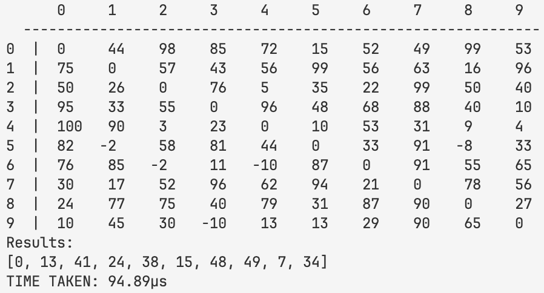
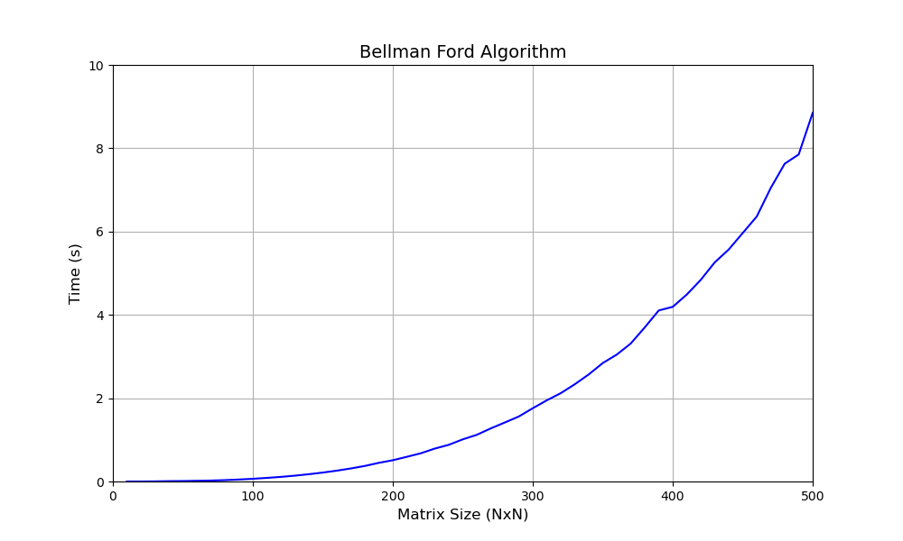

# Bellman Ford Algorithm



This project implements a simple version of the Bellman Ford Algorithm using python.

## What is the Bellman Ford Algorithm?
The Bellman Ford Algorithm is a technique that returns the shortest paths from a single vertex to all other vertices in a weighted, directed graph. Whilst it is generally slower than Dijkstra's algorithm ($`\Theta(|E| + |V|\log|V|)`$ vs $`\Theta(|V||E|)`$), it works with negative edge weights, something that Dijkstra's cannot handle. Importantly, the algorithm can also detect negative cycles (cycles whose total weight is negative) and return if one is found. This is because in a system with a negative cycle, there is no least distance between points that can reach the negative cycle.

The algorithm hinges on the idea of 'edge relaxation'. This refers to the process of checking each edge (u, v), and if the distance from the source, through u to v is less than the distance from the source to v currently, then the current distance to v is updated with this new lower value. This process is applied to every edge in the graph, a total of V-1 times, where V is the number of vertices in the graph. Finally, the algorithm checks for negative edge cycles. It does this by comparing each vertex's final value, and if applying the weight of an edge between two vertices results in a lower total, then a negative cycle has been found and is reported. 

## Testing


To verify my implementation, I ran it with intervals of 10 up to a matrix size of 500x500. Each size was tested 5 times to increase the accuracy of the results. These tests were carried out on complete, positive graphs, as this ensured the algorithm could always find a solution and never found a negative cycle. As a result of this, the number of vertices was the Matrix width `N`, whilst the number of edges was `N(N-1) / 2`. This gives a polynomial Big O notation, which is reflected in the shape of the graph.

## Requirements
Python 3 required.

### Installation
```
git clone https://github.com/Fel1x22/BellmanFord.git
cd BellmanFord
python3 BellmanFord [size]
```

## Contributing
Pull requests are welcome.

## License
This project is [MIT](https://choosealicense.com/licenses/mit/) licensed.
